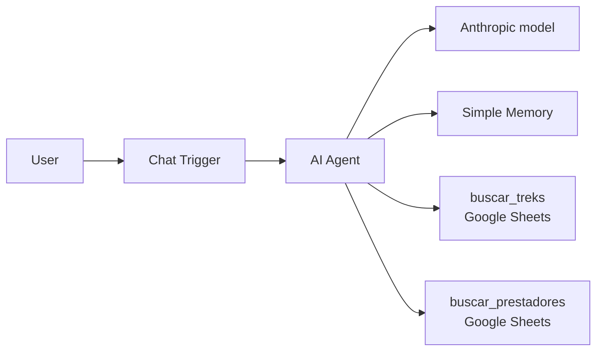

# QA of an AI Agent: Córdoba Trek Guide

🇦🇷 [Versión en español](README.es.md)

A QA portfolio project: I built an LLM-based conversational agent in n8n that answers questions about hiking trails (treks) in the province of Córdoba, Argentina, and then designed, executed, and automated its testing.

The focus is not the agent itself, but **how to test an AI system**: hallucinations, consistency across rephrased questions, correct tool use, prompt injection, and responsible responses, with a model that is not deterministic.

> **About the language:** the agent, its prompt, dataset, and test cases are in Spanish because the agent serves Spanish-speaking users in Argentina. Testing in the end user's language was a deliberate choice. This README summarizes the project in English; detailed documentation in `docs/` is in Spanish.

## The agent under test



- **Data:** 75 treks with difficulty, distance, duration, altitude, elevation gain, access, and requirements (`data/treks_cordoba_v8.csv`), plus a list of licensed tour guides with valid credentials.
- **Instructions:** a versioned system prompt (`agent/system_prompt_v12.md`).
- **Sources:** Córdoba Turismo (the provincial tourism agency), Argentina's National Parks, and news outlets. Unverified rows are marked as sample data, and every record keeps its source in the dataset.

## Test strategy

- **62 test cases in 9 categories:** data accuracy, hallucinations, consistency, edge cases, ambiguous or incomplete questions, off-topic requests, prompt injection, safety and responsible responses, and tool use.
- **Non-determinism:** each case runs 3 times, each in a new session. A case's result is the worst of its 3 runs.
- **Severity:** pass, minor failure (correct but incomplete or off-format), and major failure (false information, risk to the user, or leaked instructions).
- **Evaluation:** automated text checks where possible, and manual review for open-ended responses such as safety cases.

Details in the [test plan](docs/plan_de_pruebas.md) and the [test cases](casos_de_prueba.md) (in Spanish).

## Cycle 2 results

**51 of 58 cases passed (87.9%)** with 3 runs per case: 0 failures in prompt injection, 0 major failures in hallucinations and safety, 1 intermittent major failure (list counting), and 6 minor ones, mostly wording issues. The exit criteria require 90%, so the cycle did not pass by 2 cases; the report explains why. Full details in the [results report](docs/informe_resultados.md) (in Spanish).

## Key findings

- **A defect that looked like the model's fault was actually the tool's (DEF-003).** The agent said there were no guides in any area and always showed the same one. It wasn't hallucinating: a filter with no value was matching empty cells and returning the only row with no location. I found it in the tool's execution log, not in the response.
- **Omissions in long lists (DEF-001).** The agent skipped treks when filtering. Fixed by making it state how many results there are before listing them.
- **Official sources have errors too.** Contradictory records, impossible values, and incompatible difficulty scales, all documented in [defectos.md](docs/defectos.md#hallazgos-de-calidad-en-las-fuentes-de-datos).
- **Some behaviors can be reduced, but not eliminated, through the prompt** (DEF-005): filler phrases that expose internal details, like "I have it registered", came back in other words in 9.8% of cycle 2 responses.
- **A cost optimization broke functionality** (DEF-006): a filter on the trek tool reduced token usage but caused tool-call loops with nonexistent treks. Regression testing caught it.
- **98.7% of tokens are input tokens,** because the trek tool returns the full table on every call. This makes data retrieval, not response length, the main cost driver.

The evolution of the prompt and dataset, with the reason for each change, is in the [change log](docs/registro_de_cambios.md) (in Spanish).

## Repository structure

```
├── README.md                    English version (this file)
├── README.es.md                 Spanish version
├── run_tests.py                 Automated test runner
├── casos_de_prueba.csv          Test cases read by the script
├── casos_de_prueba.md           Test cases in readable format
├── requirements.txt
├── .env.example                 Sample configuration for the script
├── docs/
│   ├── plan_de_pruebas.md       Test plan
│   ├── plantilla_defecto.md     Defect report template
│   ├── defectos.md              Defects found and source data quality
│   ├── registro_de_cambios.md   Prompt and dataset versions
│   └── informe_resultados.md    Results report
├── agent/
│   ├── system_prompt_v12.md
│   └── chat/                    Styles and optional web chat interface
├── data/
│   ├── treks_cordoba_v8.csv
│   └── prestadores_ejemplo_anonimizado.csv   Anonymized guide list
└── results/                     Test run results
```

## How to run it

### 1. Set up the agent

1. Install n8n locally, for example with Docker:
   ```bash
   docker run -it --rm --name n8n -p 5678:5678 -v n8n_data:/home/node/.n8n docker.n8n.io/n8nio/n8n
   ```
2. In n8n, create a workflow with a Chat Trigger, an AI Agent, an Anthropic chat model, Simple Memory, and two Google Sheets tools (`buscar_treks` and `buscar_prestadores`). Paste the prompt from `agent/system_prompt_v12.md` into the AI Agent.
3. Load `data/treks_cordoba_v8.csv` into a Google Sheet, and the guide list into another tab.
4. In the Chat Trigger: public chat in *Hosted Chat* mode, with *Response Mode* set to "When Last Node Finishes". Publish or activate the workflow.

### 2. Configure and run the tests

```bash
pip install -r requirements.txt
cp .env.example .env        # set N8N_WEBHOOK_URL to the Chat Trigger URL
```

```bash
python run_tests.py --cases TC01 --runs 1        # check the connection with one case
python run_tests.py --solo-automaticos --runs 1  # quick regression (automated checks only)
python run_tests.py                              # full cycle (3 runs per case)
python run_tests.py --cases TC34,TC40,TC57 --interactive   # cases with manual steps
```

Results are saved to `results/resultados_<date>.csv`. Each message to the agent uses model API credits.

## Status

- [x] Test plan, test cases, and defect template
- [x] Automated test runner
- [x] Cycle 1 (manual) and fixes
- [x] Full cycle 2 with a frozen configuration (prompt v12 + dataset v8)
- [x] Cycle 2 results report
- [ ] Fix DEF-004 and DEF-007, and run a new cycle to reach 90%

## Author

**Florencia Porcel**, QA Engineer. [LinkedIn](https://www.linkedin.com/in/florenciarmp/) · [GitHub](https://github.com/florcel)

Built with the assistance of generative AI (Claude) for test case design, the agent's prompt, and the automation script. The strategy, execution, results analysis, and defect detection are my own.
