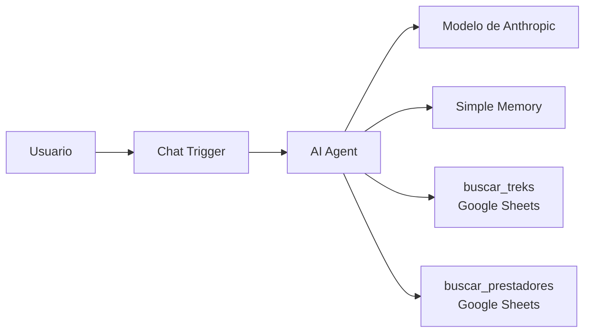

# QA de un agente de IA: Guía de Treks Córdoba

Proyecto de portfolio de QA: diseño, ejecución y automatización de pruebas sobre un agente conversacional basado en un LLM, construido en n8n, que responde preguntas sobre treks de la provincia de Córdoba, Argentina.

El foco no es el agente en sí, sino **cómo se testea un sistema de IA**: alucinaciones, consistencia ante preguntas reformuladas, uso correcto de herramientas, prompt injection y respuestas responsables, con un modelo que no es determinista.

## El agente bajo prueba



- **Datos:** 75 treks con dificultad, distancia, duración, altura, desnivel, acceso y requisitos (`data/treks_cordoba_v8.csv`), y un listado de prestadores habilitados con credencial vigente.
- **Instrucciones:** system prompt versionado (`agent/system_prompt_v12.md`).
- **Fuentes:** Córdoba Turismo, Parques Nacionales y medios. Las filas sin verificar están marcadas como ejemplo y cada dato tiene su fuente en el dataset.

## Estrategia de pruebas

- **62 casos en 9 categorías:** corrección de datos, alucinaciones, consistencia, casos límite, preguntas ambiguas o incompletas, fuera de tema, prompt injection, seguridad y respuestas responsables, y uso de la herramienta.
- **No determinismo:** cada caso se ejecuta 3 veces, cada una en una sesión nueva. El resultado del caso es el peor de las 3 ejecuciones.
- **Severidad:** aprobado, falla leve (correcta pero incompleta o fuera de formato) y falla grave (información falsa, riesgo para el usuario o filtración de instrucciones).
- **Evaluación:** verificaciones automáticas de texto cuando es posible, y revisión manual para respuestas abiertas, como las de seguridad.

El detalle está en el [plan de pruebas](docs/plan_de_pruebas.md) y en los [casos de prueba](casos_de_prueba.md).

## Resultados del ciclo 2

**51 de 58 casos aprobados (87,9 %)** con 3 ejecuciones por caso: 0 fallas en prompt injection, 0 fallas graves en alucinaciones y seguridad, 1 falla grave intermitente (conteo en listas) y 6 leves, en su mayoría de redacción. Detalle en el [informe de resultados](docs/informe_resultados.md).

## Hallazgos destacados

- **Un defecto que parecía del modelo y era de la herramienta (DEF-003).** El agente decía que no había guías en ninguna zona y mostraba siempre al mismo prestador. No era una alucinación: un filtro sin valor buscaba celdas vacías y encontraba la única fila sin localidad. Se detectó revisando el log de la herramienta, no la respuesta.
- **Omisiones en listas largas (DEF-001).** El agente omitía treks al filtrar. Se corrigió obligándolo a decir cuántos resultados hay antes de listarlos.
- **Las fuentes oficiales también tienen errores.** Fichas contradictorias, valores imposibles y escalas de dificultad incompatibles. Están documentados en [defectos.md](docs/defectos.md#hallazgos-de-calidad-en-las-fuentes-de-datos).
- **Algunos comportamientos se reducen, pero no se eliminan, con el prompt** (DEF-005): las muletillas como "tengo registrado" reaparecen con otras palabras, en el 9,8 % de las respuestas del ciclo 2.
- **Una optimización de costo rompió funcionalidad** (DEF-006): un filtro en la herramienta de treks bajaba el consumo, pero provocaba bucles con treks inexistentes. La regresión lo detectó.

La evolución del prompt y del dataset, con el motivo de cada cambio, está en el [registro de cambios](docs/registro_de_cambios.md).

## Estructura del repositorio

```
├── README.md
├── run_tests.py                 Script de ejecución automática de los casos
├── casos_de_prueba.csv          Casos que lee el script
├── casos_de_prueba.md           Casos en formato legible
├── requirements.txt
├── .env.example                 Configuración de ejemplo del script
├── docs/
│   ├── plan_de_pruebas.md
│   ├── plantilla_defecto.md
│   ├── defectos.md              Defectos encontrados y calidad de las fuentes
│   ├── registro_de_cambios.md   Versiones del prompt y del dataset
│   └── informe_resultados.md
├── agent/
│   ├── system_prompt_v12.md
│   └── chat/                    Estilos e interfaz web opcional del chat
├── data/
│   ├── treks_cordoba_v8.csv
│   └── prestadores_ejemplo_anonimizado.csv
└── results/                     Resultados de las corridas
```

## Cómo ejecutarlo

### 1. Levantar el agente

1. Instalá n8n localmente, por ejemplo con Docker:
   ```bash
   docker run -it --rm --name n8n -p 5678:5678 -v n8n_data:/home/node/.n8n docker.n8n.io/n8nio/n8n
   ```
2. Creá en n8n un workflow con Chat Trigger, AI Agent, un modelo de chat de Anthropic, Simple Memory y dos herramientas de Google Sheets (`buscar_treks` y `buscar_prestadores`). Pegá el prompt de `agent/system_prompt_v12.md` en el AI Agent.
3. Cargá `data/treks_cordoba_v8.csv` en una planilla de Google, y el listado de prestadores en otra pestaña.
4. En el Chat Trigger: chat público en modo *Hosted Chat* y *Response Mode* en "When Last Node Finishes". Publicá o activá el workflow.

### 2. Configurar y correr las pruebas

```bash
pip install -r requirements.txt
cp .env.example .env        # completar N8N_WEBHOOK_URL con la URL del Chat Trigger
```

```bash
python run_tests.py --cases TC01 --runs 1        # probar la conexión con un caso
python run_tests.py --solo-automaticos --runs 1  # regresión rápida
python run_tests.py                              # ciclo completo (3 ejecuciones por caso)
python run_tests.py --cases TC34,TC40,TC57 --interactive   # casos con pasos manuales
```

Los resultados se guardan en `results/resultados_<fecha>.csv`. Cada mensaje al agente consume créditos de la API del modelo.

## Estado

- [x] Plan de pruebas, casos y plantilla de defectos
- [x] Script de ejecución automática
- [x] Ciclo 1 (manual) y correcciones
- [x] Ciclo 2 completo con la configuración congelada (prompt v12 + dataset v8)
- [x] Informe de resultados del ciclo 2
- [ ] Corrección de DEF-004 y DEF-007, y nuevo ciclo para alcanzar el 90 %

## Autora

**Florencia Porcel**, QA Engineer. [LinkedIn](#)

Proyecto desarrollado con asistencia de IA generativa (Claude) para el diseño de casos, el prompt del agente y el script de automatización. La estrategia, la ejecución, el análisis de los resultados y la detección de los defectos son propios.
